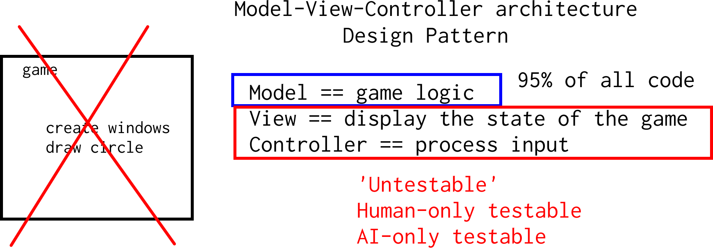

# basketball
# bla
Trêsinformal's 2023 team basketball game 

Branch      ||
------------|-----------------------------------------------------------------------------------------------------|-------------------------------------------------------------------------------------------------------------------------------------------------------
`master`    |   |
`develop`   |  |

## Meetings

 * Date: Weekly, every Wednesday
 * Time: 17:00-19:00 Amsterdam/Stockholm time
 * On Discord, see [FAQ](faq.md)
 * Considering to join? See the [FAQ](faq.md) too :-)

## Game design document

> The game design document is written in English.
> Ideally each sentence is `SMAR` (specific, measurable, assignable, relevant,
> see [SMART criteria](https://en.wikipedia.org/wiki/SMART_criteria)),
> linked to (at least) one Issue.
> The game designers decide what is in the game design document.
> (see Issues what are the criteria for a good Issue)

The game has two players [#13].
The game finishes when on player reaches 20 points.
The game has one basketball [#14].
All objects follow the laws of gravity (Newton's Second Law) [#15].
 There is an option to play on one side or two sides.
There is either one human player and a player controlled by computer or two human players.
There are two baskets, one in the each half of the yard. 
The player's clothes should have diffrent colors. 
The game has a music.
The player can mute it if she/he wants. 
The game counts a time. 
During the game the time shows. 
The game can be paused. 
If the player scores from inside the line, she/he gets two points. 
If the player scores from outside the line she/he gets three points.
If one player throws the ball, the other player can catch it. 
both players can jump. 
When the ball is free, the players can run into it and take it. 
The ball bounces.
A player can take the ball from another player by running into her/him and pressing a key.
The key needs to be released to try again. 
The player can choose if she/he wants to play as a girl or a boy. 
The player can choose a flag for her/his team. 
Both players can't choose same flags.
The scores of both playes are visible on the screen.
The player can choose the hair color. 
The player can choose the skin color.

 
 
 
  
 

  

[The game finishes when on player reaches 20 points](https://github.com/tresinformal/basketball/issues/23).

[The game has two players](https://github.com/tresinformal/basketball/issues/11).
[The game has one basketball](https://github.com/tresinformal/basketball/issues/14).
[A basketball's center has a coordinate with an x and a y](https://github.com/tresinformal/basketball/issues/30).
[The (one) ball starts at the top-center of the screen](https://github.com/tresinformal/basketball/issues/25).

All objects follow the laws of gravity (Newton's Second Law):

 * the [basketball](https://github.com/tresinformal/basketball/issues/15)
 * [others]

There is an option to play on one side or two sides.

## Issues

> Issues are the technical translation of the game design document.
> Ideally each sentence in the design document results in one Issue.

There are two types of Issues:

 * Testable: deal with the game logic and 
   contains a test in pseudocode (when written by juniors) or 
   C++ (when written by mediors and seniors).
 * Untestable: deal with how the game looks like
   and needs to be verified by a human

We use the Model-View-Controller Design Pattern to separate the game logic,
from the game visualization and input:

## git branching model

Our `git` branching model:

 * `master`/`main`: a working version
 * `develop`: merging topic branches
 * topic branches: where work is done,
   for example, Issue `x` is done on 
   a branch called `issue_x`

Videos:

 * [Overview of the git branches](https://youtu.be/trLafZpD1Tg?si=ZliLdIQ8KXDW7xjq)
 * [Working with this git branching model](https://youtu.be/pM520_JLR6w?si=1pvh5uUjXFJPPqGZ)

## GitHub workflows

  1. [Modify README on main branch using GitHub web interface](https://youtu.be/xBH2xZoKof4?si=ohdG6-y8lzarSqIa)
  2. [Modify README on topic branch using GitHub web interface](https://youtu.be/vPyHWsnbXw8?si=XjD6a3WDY44I97Se)
  3. [Modify README on main branch using git](https://youtu.be/A85wZTiCMTc?si=oUyrg_53gVlqEanb)
  4. [Modify README on topic branch using git](https://youtu.be/ZkfjAfu9Wo4?si=myBTkJ179n9fXHrS)
  5. [Merge topic branch to develop yourself](https://youtu.be/1fKdU1m3Uug?si=qox0K-EdZ-tDpcRY)
  6. [Merge topic branch to develop with a code review](https://youtu.be/VexyXysb-BM?si=uCOuqCVuZ_ylsUtI)

## Project workflows

 * [From design to feature](https://youtu.be/f-rzfZtsPKU)
 * [Splitting up an Issues to smaller Issues](https://youtu.be/mhIBXfxVxIU)
Hello.

